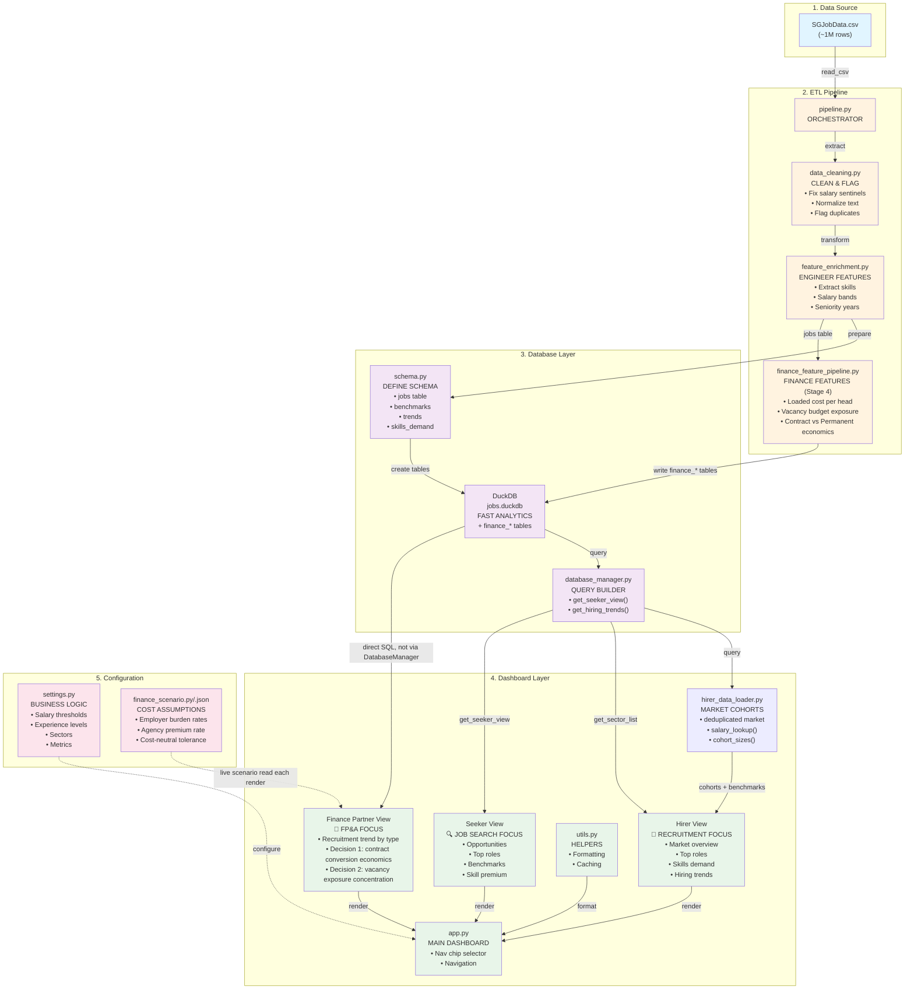

> **Staleness note:** this diagram predates the Finance Business Partner board.
> The Finance-related nodes below (`finance_feature_pipeline.py`,
> `finance_scenario.py/.json`, the Finance Partner view) reflect the current
> code as of this update; other nodes (Hirer/Seeker internals in particular)
> may still lag what's actually in `src/`. Where this disagrees with the
> code, trust the code.



## Data Flow Visualization

### Pipeline Phase (Left to Right)
```
CSV Data → Extract → Clean → Engineer Features → Schema → DuckDB
```

### Query Phase (Bottom to Top)
```
DuckDB → Database Manager → Hirer/Seeker Queries → Dashboard UI
```

### User Interaction (Dashboard)
```
User selects view (Hirer/Seeker/Finance Partner)
    ↓
Selects filters (sector, experience / year, sub-sector, keyword for Finance)
    ↓
Query builder creates SQL
    ↓
DuckDB returns results
    ↓
Dashboard renders metrics & charts
```

### Finance Partner Interaction (differs from Hirer/Seeker)
```
User selects Year → Sector → Sub-sector → optional Skill/Keyword
    ↓
finance_view.py builds SQL directly against finance_job_features
(re-prices loaded cost live from config/finance_scenario.json --
 NOT from database_manager.py, and NOT the rates baked in at last
 pipeline run)
    ↓
Three tabs: Recruitment Trend | Decision 1 (Contract Conversion)
           | Decision 2 (Exposure Concentration)
```

## Component Dependencies

```
┌─ settings.py (Configuration)
│   └─ app.py (uses business metrics, sectors)
│
├─ pipeline.py (Orchestrator)
│   ├─ data_cleaning.py
│   └─ feature_enrichment.py
│       └─ schema.py (DuckDB tables)
│           └─ database_manager.py (Query builder)
│
└─ app.py (Streamlit)
    ├─ database_manager.py (queries)
    ├─ utils.py (helpers)
    └─ settings.py (UI config)
```

## Data Schema

```sql
-- Main table
CREATE TABLE jobs (
    job_id VARCHAR PRIMARY KEY,
    title VARCHAR,
    company VARCHAR,
    sector VARCHAR,
    location VARCHAR,
    salary_min INTEGER,           -- engineered
    salary_max INTEGER,           -- engineered
    experience_level VARCHAR,     -- engineered
    seniority_years INTEGER,      -- engineered
    skill_count INTEGER,          -- engineered
    salary_midpoint FLOAT,        -- engineered
    salary_band VARCHAR,          -- engineered
    competitiveness_score FLOAT,  -- engineered
    posting_date DATE,
    skills TEXT,
    description TEXT,
    created_at TIMESTAMP
);

-- Aggregated views for analytics
salary_benchmarks (role, exp_level, sector, p25/p50/p75/p90)
market_trends (date, sector, role, posting_count, avg_salary)
skills_demand (skill, postings, avg_salary, trend_direction)
role_statistics (role, sector, postings, avg_salary, top_skills)

-- Finance Business Partner feature tables (written by
-- finance_feature_pipeline.py, Stage 4 of the pipeline)
finance_scenario_params (
    -- one row: the cost assumptions used for this pipeline run
    permanent_employer_burden_rate, contract_employer_burden_rate,
    contract_agency_premium_rate, days_per_month,
    cost_neutral_tolerance_rate, salary_planning_cap_quantile,
    min_cohort_postings
)
finance_job_features (
    -- one row per job posting, loaded-cost columns re-priced live by
    -- the dashboard from finance_scenario.json (not read from here as-is)
    job_id, sector, sub_sector, position_level, employment_type,
    employment_cohort,              -- 'Permanent' | 'Contract' | 'Other'
    planning_salary_midpoint_monthly,
    loaded_monthly_cost_per_head, loaded_monthly_cost_for_vacancies,
    posting_window_days, number_of_vacancies,
    vacancy_budget_exposure, vacancy_exposure_per_opening
)
finance_industry_budget_risk (
    -- offline snapshot, not read live by the dashboard
    sector, postings, vacancies, total_vacancy_budget_exposure,
    median_exposure_per_opening, budget_exposure_rank
)
finance_permanent_contract_conversion_economics (
    -- offline snapshot, not read live by the dashboard
    sector, position_level, postings_contract, postings_permanent,
    median_loaded_monthly_cost_contract, median_loaded_monthly_cost_permanent,
    monthly_cost_delta_contract_minus_permanent, contract_cost_delta_rate,
    conversion_decision            -- 'Savings' | 'Cost premium' | 'Cost neutral'
)
```

## Query Examples

### Hirer Query: Top Roles by Demand
```python
db.query("""
    SELECT 
        title,
        COUNT(*) as postings,
        AVG(salary_max) as avg_salary,
        COUNT(DISTINCT company) as companies
    FROM jobs
    WHERE sector = 'Technology'
    GROUP BY title
    ORDER BY postings DESC
    LIMIT 10
""")
```

### Seeker Query: Salary Benchmarks
```python
db.query("""
    SELECT 
        title,
        experience_level,
        PERCENTILE_CONT(0.25) WITHIN GROUP (ORDER BY salary_min) as p25,
        PERCENTILE_CONT(0.50) WITHIN GROUP (ORDER BY salary_max) as p50,
        PERCENTILE_CONT(0.75) WITHIN GROUP (ORDER BY salary_max) as p75
    FROM jobs
    WHERE experience_level = 'Mid Level'
    GROUP BY title, experience_level
    ORDER BY p50 DESC
""")
```

### Finance Query: Vacancy Budget Exposure by Position Level
```python
# finance_view.py re-prices loaded cost live from finance_scenario.json
# rather than trusting the rates baked into finance_job_features at the
# last pipeline run -- see _priced_job_features_sql() for the full CTE.
db.query("""
    SELECT
        position_level,
        COUNT(*) AS postings,
        SUM(number_of_vacancies) AS vacancies,
        MEDIAN(posting_window_days) AS median_posting_window_days,
        SUM(vacancy_budget_exposure) AS total_vacancy_budget_exposure,
        MEDIAN(vacancy_exposure_per_opening) AS median_exposure_per_opening
    FROM finance_job_features
    WHERE EXTRACT(YEAR FROM posting_date) = 2023
      AND sector = 'Information Technology'
    GROUP BY position_level
    HAVING SUM(number_of_vacancies) > 0
    ORDER BY total_vacancy_budget_exposure DESC
""")
```

## Deployment Architecture (Future)

```
┌─────────────────────────────────────┐
│  Streamlit Cloud / Docker Container │
│                                     │
│  ┌─────────────────────────────┐   │
│  │    Streamlit Dashboard      │   │
│  │   (app.py running)          │   │
│  └─────────────┬───────────────┘   │
│                │                    │
│  ┌─────────────▼───────────────┐   │
│  │    Database Manager Layer   │   │
│  │   (query builder)           │   │
│  └─────────────┬───────────────┘   │
│                │                    │
│  ┌─────────────▼───────────────┐   │
│  │    DuckDB / PostgreSQL      │   │
│  │   (persistent data store)   │   │
│  └─────────────────────────────┘   │
│                                     │
└─────────────────────────────────────┘
         ↑
    Scheduled Pipeline
    (daily/weekly)
    python src/pipeline/pipeline.py
```

## Team Collaboration Model

```
Team Member 1: Data Engineer
    └─ Maintains src/pipeline/*
       └─ Runs ETL: python src/pipeline/pipeline.py
          └─ Validates data quality

Team Member 2: Analytics Engineer
    └─ Maintains database_manager.py
       └─ Builds queries: get_seeker_view(), get_hiring_trends()
          └─ Creates benchmarks & aggregations

Team Member 3: Frontend Developer
    └─ Maintains src/dashboard/app.py
       └─ Builds UI components
          └─ Integrates visualizations

Team Member 4: Product Manager / QA
    └─ Maintains TEAM_GUIDE.md & business logic
       └─ Tests functionality
          └─ Validates requirements

Team Member 5: DevOps / Documentation
    └─ Maintains tests/, setup.sh
       └─ Writes documentation
          └─ Prepares deployment

Team Member 6: Finance / FP&A Analyst
    └─ Maintains src/pipeline/finance_feature_pipeline.py,
       config/finance_scenario.py + finance_scenario.json,
       src/dashboard/finance_view.py
       └─ Owns the loaded-cost model (employer burden, agency premium)
          └─ Validates contract-vs-permanent conversion economics
```

## Performance Considerations

### Why DuckDB?
- ✅ Fast OLAP queries (column-oriented)
- ✅ Handles 1M+ rows easily
- ✅ No server needed (embedded)
- ✅ Supports complex SQL

### Optimization Strategies
1. **Indexes:** Add on frequently filtered columns (sector, experience_level)
2. **Partitioning:** By date (posting_date) for time-series queries
3. **Caching:** Use `@st.cache_data` in Streamlit for repeated queries
4. **Sampling:** Test queries on 50k row sample before full dataset

### Scaling Path
- **Phase 1:** DuckDB (current, 1M rows)
- **Phase 2:** PostgreSQL (multi-user, persistent)
- **Phase 3:** Cloud warehouse (Snowflake, BigQuery)
