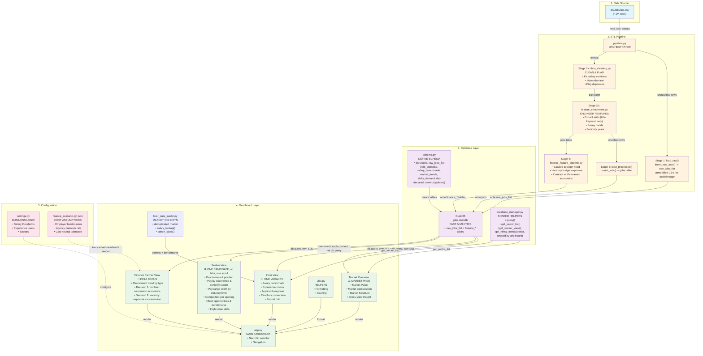

> **Staleness note:** this file is checked against the code as of this update
> (verified: `jobs` table schema, all four boards' tabs, which
> `database_manager.py` methods are actually called, and the query examples
> below). It can still drift as the code changes — where this disagrees with
> `src/`, trust the code.



## Data Flow Visualization

### Pipeline Phase (Left to Right)
```
CSV Data → Extract → Clean → Engineer Features → Schema → DuckDB
```

### Query Phase (Bottom to Top)
```
DuckDB → each board's own SQL → Dashboard UI
```
Every board (Market Overview, Hirer, Seeker, Finance) writes and owns its
own SQL rather than going through a shared `get_*_view()` aggregator.
Market Overview, Hirer, and Finance issue it via `db.query()`
(`DatabaseManager`); Seeker bypasses `DatabaseManager` entirely and opens
its own cached raw `duckdb.connect()` instead. `database_manager.py`'s
`get_seeker_view()` and `get_hiring_trends()` methods still exist but are
not called by any board; `get_sector_list()` is the one method genuinely
shared, by Market Overview and Hirer.

### User Interaction (Dashboard)
```
User selects a board (Market Overview / Hirer / Seeker / Finance Partner)
    ↓
Selects filters (sector/position level for Market Overview, a vacancy config
for Hirer, industry/experience/salary for Seeker, year/sector/sub-sector/
keyword for Finance)
    ↓
That board's own module builds SQL and queries DuckDB (db.query()
for Market Overview/Hirer/Finance; its own raw duckdb.connect() for Seeker)
    ↓
DuckDB returns results
    ↓
Dashboard renders metrics & charts
```

### Finance Partner Interaction (one live-pricing detail the other boards don't have)
```
User selects Year → Sector → Sub-sector → optional Skill/Keyword
    ↓
finance_view.py builds SQL directly against finance_job_features
(re-prices loaded cost live from config/finance_scenario.json --
 NOT the rates baked in at last pipeline run)
    ↓
Three tabs: Recruitment Trend | Decision 1 (Contract Conversion)
           | Decision 2 (Exposure Concentration)
```

## Component Dependencies

```
config/settings.py (Configuration)
    ├─ schema.py, database_manager.py, pipeline.py, app.py all import from it

pipeline.py (Orchestrator)
    ├─ data_cleaning.py            -- no internal deps of its own
    ├─ feature_enrichment.py       -- no internal deps of its own
    ├─ finance_feature_pipeline.py
    ├─ schema.py (initialize_database)
    └─ database_manager.py (DatabaseManager)

database_manager.py
    ├─ schema.py (JOBS_SCHEMA, initialize_database)
    └─ feature_enrichment.py (JOBS_SCHEMA_COLUMNS)

app.py (Streamlit)
    ├─ database_manager.py (DatabaseManager)
    └─ market_overview.py, hirer_view.py, seeker_view.py, finance_view.py
```
Real import direction, not a layering metaphor: `feature_enrichment.py` and
`data_cleaning.py` import nothing from this project (`schema.py` does NOT
depend on them, the reverse is true) -- `database_manager.py` is the one
that imports from both `schema.py` and `feature_enrichment.py`.

## Data Schema

### Raw layer: `raw_jobs_flat`

The pipeline's Stage 1 (`pipeline.py`'s `load_raw()` -> `insert_raw_jobs()`)
loads the CSV into this table completely unmodified, before any cleaning —
an audit trail so a processed row can always be traced back to its original
source values. `src/audit/data_audit.py`'s `audit_raw_layer()` and
`DataAudit.audit_lineage_sample()` read from it; `database_manager.py`'s
`compare_raw_vs_processed()` compares row counts against `jobs` (no join);
`audit_data_lineage(raw_id)` looks up one raw record, then separately
queries `jobs WHERE company = ... AND title = ...` -- an approximate match,
not a real join (no `raw_id` foreign key exists on `jobs`). The table
mirrors the flattened source CSV/API fields, not the cleaned/renamed `jobs`
column names below:

```sql
-- src/database/schema.py, RAW_JOBS_FLAT_SCHEMA
CREATE TABLE raw_jobs_flat (
    raw_id VARCHAR PRIMARY KEY,   -- random UUID per row, not deduplicated
    categories VARCHAR,           -- raw JSON array, not yet parsed
    employmentTypes VARCHAR,
    metadata_expiryDate VARCHAR,
    metadata_isPostedOnBehalf VARCHAR,
    metadata_jobPostId VARCHAR,
    metadata_newPostingDate VARCHAR,
    metadata_originalPostingDate VARCHAR,
    metadata_repostCount VARCHAR,
    metadata_totalNumberJobApplication VARCHAR,
    metadata_totalNumberOfView VARCHAR,
    minimumYearsExperience VARCHAR,
    numberOfVacancies VARCHAR,
    occupationId VARCHAR,
    positionLevels VARCHAR,
    postedCompany_name VARCHAR,
    salary_maximum VARCHAR,
    salary_minimum VARCHAR,
    salary_type VARCHAR,
    status_id VARCHAR,
    status_jobStatus VARCHAR,
    title VARCHAR,
    average_salary VARCHAR,
    loaded_at TIMESTAMP DEFAULT current_timestamp,
    raw_column_count INTEGER,
    raw_null_count INTEGER
);
```

### Processed layer: `jobs`

```sql
-- Main table (src/database/schema.py, JOBS_SCHEMA)
CREATE TABLE jobs (
    job_id VARCHAR PRIMARY KEY,
    title VARCHAR NOT NULL,
    company VARCHAR NOT NULL,
    sector VARCHAR,
    sub_sector VARCHAR,
    location VARCHAR,              -- always NULL -- not in JOBS_SCHEMA_COLUMNS, insert_jobs doesn't backfill it either
    salary_min INTEGER,
    salary_max INTEGER,
    salary_currency VARCHAR,       -- constant 'SGD'
    experience_level VARCHAR,      -- 'Entry Level' | 'Mid Level' | 'Senior' | 'Unknown' -- engineered, band_experience()
    seniority_years INTEGER,       -- engineered
    position_level VARCHAR,        -- source seniority label, e.g. 'Fresh/entry level'
    job_type VARCHAR,
    posting_date DATE,
    expiry_date DATE,
    views INTEGER,
    applications INTEGER,
    vacancies INTEGER,
    repost_count INTEGER,
    skills TEXT,                   -- title-keyword matches only (no description field exists)
    description TEXT,              -- empty in the real data, not populated
    requirements TEXT,             -- empty in the real data, not populated
    dup_group_id INTEGER,          -- same-day duplicate group, see data_cleaning.py
    salary_midpoint FLOAT,         -- engineered
    salary_flag VARCHAR,           -- 'ok' | 'low_stipend' | 'outlier' | 'undisclosed' -- engineered
    listing_days SMALLINT,         -- metadata_expiryDate - metadata_newPostingDate (NOT expiry_date - posting_date;
                                    -- posting_date is renamed from the different metadata_originalPostingDate field --
                                    -- an intentional split documented in feature_enrichment.py, not a bug. The two
                                    -- formulas disagree on ~4% of rows, reposted listings where original != newest.
    is_repost BOOLEAN,
    created_at TIMESTAMP
);

-- Declared in schema.py but never populated -- created empty by
-- initialize_database() and never written to by pipeline.py or
-- database_manager.py. Not read by any board. Not part of the actual
-- pipeline output, unlike the finance_* tables below.
role_statistics (role_name, sector, total_postings, avg_salary, ...)
salary_benchmarks (benchmark_id, role, experience_level, sector, salary_p25/p50/p75/p90, ...)
market_trends (trend_id, trend_date, sector, role, posting_count, avg_salary, ...)
skills_demand (skill_id, skill_name, total_postings, avg_salary, trend_direction, ...)

-- Finance Business Partner feature tables (written by
-- finance_feature_pipeline.py, Stage 4 of the pipeline)
finance_scenario_params (
    -- one row: the cost assumptions used for this pipeline run
    permanent_employer_burden_rate, contract_employer_burden_rate,
    contract_agency_premium_rate, days_per_month,
    cost_neutral_tolerance_rate, salary_planning_cap_quantile,
    min_cohort_postings
)
finance_job_features (
    -- one row per job posting, loaded-cost columns re-priced live by
    -- the dashboard from finance_scenario.json (not read from here as-is)
    job_id, sector, sub_sector, position_level, employment_type,
    employment_cohort,              -- 'Permanent' | 'Contract' | 'Other'
    planning_salary_midpoint_monthly,
    loaded_monthly_cost_per_head, loaded_monthly_cost_for_vacancies,
    posting_window_days, number_of_vacancies,
    vacancy_budget_exposure, vacancy_exposure_per_opening
)
finance_industry_budget_risk (
    -- offline snapshot, not read live by the dashboard
    sector, postings, vacancies, total_vacancy_budget_exposure,
    median_exposure_per_opening, budget_exposure_rank
)
finance_permanent_contract_conversion_economics (
    -- offline snapshot, not read live by the dashboard
    sector, position_level, postings_contract, postings_permanent,
    median_loaded_monthly_cost_contract, median_loaded_monthly_cost_permanent,
    monthly_cost_delta_contract_minus_permanent, contract_cost_delta_rate,
    conversion_decision            -- 'Savings' | 'Cost premium' | 'Cost neutral'
)
```

## Query Examples

Hirer and Seeker are mostly **not** per-metric SQL: `hirer_data_loader.py` and
`seeker_view.py` each load the deduplicated market into one cached pandas
DataFrame (`_market()` / `_cached_seeker_dataset()`) and compute their
figures with pandas from there, re-querying DuckDB only to build that cache.
Market Overview and Finance are the SQL-heavy boards — every figure is its
own `db.query()` call.

### Market Overview Query: Industries Ranked by Posting Count
```python
# market_overview.py's fetch_industry_ranking(), against the deduplicated
# jobs CTE most fetch_* functions in this board query instead of `jobs`
# directly, so same-day duplicates don't double-count postings. Not all --
# fetch_position_levels() and the two functions that read finance_job_features
# (fetch_contract_premium, fetch_exposure_by_sector) query those tables directly.
db.query("""
    WITH deduped_jobs AS (
        SELECT * FROM jobs
        QUALIFY ROW_NUMBER() OVER (PARTITION BY dup_group_id ORDER BY posting_date, job_id) = 1
    )
    SELECT sector, COUNT(*) AS postings
    FROM deduped_jobs
    WHERE posting_date IS NOT NULL
    GROUP BY sector
    ORDER BY postings DESC
""")
```

### Finance Query: Vacancy Budget Exposure by Position Level
```python
# finance_view.py's _fetch_exposure_by_position_level(). {priced} is NOT the
# finance_job_features table itself -- it's _priced_job_features_sql(params),
# a CTE that re-derives loaded_monthly_cost_per_head and vacancy_budget_exposure
# live from finance_scenario.json on every call, discarding the rates baked
# into finance_job_features at the last pipeline run.
db.query(f"""
    SELECT
        position_level,
        COUNT(*) AS postings,
        SUM(number_of_vacancies) AS vacancies,
        MEDIAN(posting_window_days) AS median_posting_window_days,
        SUM(vacancy_budget_exposure) AS total_vacancy_budget_exposure,
        MEDIAN(vacancy_exposure_per_opening) AS median_exposure_per_opening
    FROM {{priced}} f
    WHERE EXTRACT(YEAR FROM f.posting_date) = 2023
      AND f.sector = 'Information Technology'
    GROUP BY position_level
    HAVING SUM(number_of_vacancies) > 0
    ORDER BY total_vacancy_budget_exposure DESC
    LIMIT 12
""")
```

## Deployment Architecture (Future)

```
┌─────────────────────────────────────┐
│  Streamlit Cloud / Docker Container │
│                                     │
│  ┌─────────────────────────────┐   │
│  │    Streamlit Dashboard      │   │
│  │   (app.py running)          │   │
│  └─────────────┬───────────────┘   │
│                │                    │
│  ┌─────────────▼───────────────┐   │
│  │    Database Manager Layer   │   │
│  │   (query builder)           │   │
│  └─────────────┬───────────────┘   │
│                │                    │
│  ┌─────────────▼───────────────┐   │
│  │    DuckDB / PostgreSQL      │   │
│  │   (persistent data store)   │   │
│  └─────────────────────────────┘   │
│                                     │
└─────────────────────────────────────┘
         ↑
    Scheduled Pipeline
    (daily/weekly)
    python src/pipeline/pipeline.py
```

## Performance Considerations

### Why DuckDB?
- ✅ Fast OLAP queries (column-oriented)
- ✅ Handles 1M+ rows easily
- ✅ No server needed (embedded)
- ✅ Supports complex SQL

### Optimization Strategies
1. **Indexes:** Add on frequently filtered columns (sector, experience_level)
2. **Partitioning:** By date (posting_date) for time-series queries
3. **Caching:** Use `@st.cache_data` in Streamlit for repeated queries
4. **Sampling:** Test queries on 50k row sample before full dataset

### Scaling Path
- **Phase 1:** DuckDB (current, 1M rows)
- **Phase 2:** PostgreSQL (multi-user, persistent)
- **Phase 3:** Cloud warehouse (Snowflake, BigQuery)
