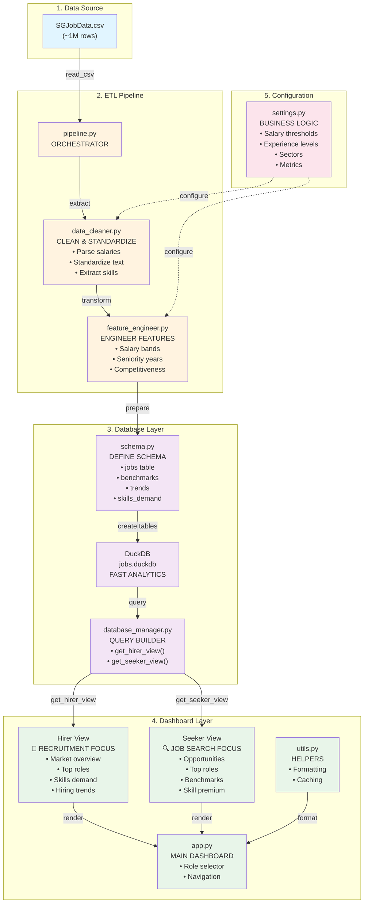

## Data Flow Visualization

### Pipeline Phase (Left to Right)
```
CSV Data → Extract → Clean → Engineer Features → Schema → DuckDB
```

### Query Phase (Bottom to Top)
```
DuckDB → Database Manager → Hirer/Seeker Queries → Dashboard UI
```

### User Interaction (Dashboard)
```
User selects view (Hirer/Seeker)
    ↓
Selects filters (sector, experience)
    ↓
Query builder creates SQL
    ↓
DuckDB returns results
    ↓
Dashboard renders metrics & charts
```

## Component Dependencies

```
┌─ settings.py (Configuration)
│   ├─ data_cleaner.py (uses salary thresholds, experience levels)
│   ├─ feature_engineer.py (uses experience categories)
│   └─ app.py (uses business metrics, sectors)
│
├─ pipeline.py (Orchestrator)
│   ├─ data_cleaner.py
│   └─ feature_engineer.py
│       └─ schema.py (DuckDB tables)
│           └─ database_manager.py (Query builder)
│
└─ app.py (Streamlit)
    ├─ database_manager.py (queries)
    ├─ utils.py (helpers)
    └─ settings.py (UI config)
```

## Data Schema

```sql
-- Main table
CREATE TABLE jobs (
    job_id VARCHAR PRIMARY KEY,
    title VARCHAR,
    company VARCHAR,
    sector VARCHAR,
    location VARCHAR,
    salary_min INTEGER,           -- engineered
    salary_max INTEGER,           -- engineered
    experience_level VARCHAR,     -- engineered
    seniority_years INTEGER,      -- engineered
    skill_count INTEGER,          -- engineered
    salary_midpoint FLOAT,        -- engineered
    salary_band VARCHAR,          -- engineered
    competitiveness_score FLOAT,  -- engineered
    posting_date DATE,
    skills TEXT,
    description TEXT,
    created_at TIMESTAMP
);

-- Aggregated views for analytics
salary_benchmarks (role, exp_level, sector, p25/p50/p75/p90)
market_trends (date, sector, role, posting_count, avg_salary)
skills_demand (skill, postings, avg_salary, trend_direction)
role_statistics (role, sector, postings, avg_salary, top_skills)
```

## Query Examples

### Hirer Query: Top Roles by Demand
```python
db.query("""
    SELECT 
        title,
        COUNT(*) as postings,
        AVG(salary_max) as avg_salary,
        COUNT(DISTINCT company) as companies
    FROM jobs
    WHERE sector = 'Technology'
    GROUP BY title
    ORDER BY postings DESC
    LIMIT 10
""")
```

### Seeker Query: Salary Benchmarks
```python
db.query("""
    SELECT 
        title,
        experience_level,
        PERCENTILE_CONT(0.25) WITHIN GROUP (ORDER BY salary_min) as p25,
        PERCENTILE_CONT(0.50) WITHIN GROUP (ORDER BY salary_max) as p50,
        PERCENTILE_CONT(0.75) WITHIN GROUP (ORDER BY salary_max) as p75
    FROM jobs
    WHERE experience_level = 'Mid Level'
    GROUP BY title, experience_level
    ORDER BY p50 DESC
""")
```

## Deployment Architecture (Future)

```
┌─────────────────────────────────────┐
│  Streamlit Cloud / Docker Container │
│                                     │
│  ┌─────────────────────────────┐   │
│  │    Streamlit Dashboard      │   │
│  │   (app.py running)          │   │
│  └─────────────┬───────────────┘   │
│                │                    │
│  ┌─────────────▼───────────────┐   │
│  │    Database Manager Layer   │   │
│  │   (query builder)           │   │
│  └─────────────┬───────────────┘   │
│                │                    │
│  ┌─────────────▼───────────────┐   │
│  │    DuckDB / PostgreSQL      │   │
│  │   (persistent data store)   │   │
│  └─────────────────────────────┘   │
│                                     │
└─────────────────────────────────────┘
         ↑
    Scheduled Pipeline
    (daily/weekly)
    python src/pipeline/pipeline.py
```

## Team Collaboration Model

```
Team Member 1: Data Engineer
    └─ Maintains src/pipeline/*
       └─ Runs ETL: python src/pipeline/pipeline.py
          └─ Validates data quality

Team Member 2: Analytics Engineer
    └─ Maintains database_manager.py
       └─ Builds queries: get_hirer_view(), get_seeker_view()
          └─ Creates benchmarks & aggregations

Team Member 3: Frontend Developer
    └─ Maintains src/dashboard/app.py
       └─ Builds UI components
          └─ Integrates visualizations

Team Member 4: Product Manager / QA
    └─ Maintains TEAM_GUIDE.md & business logic
       └─ Tests functionality
          └─ Validates requirements

Team Member 5: DevOps / Documentation
    └─ Maintains tests/, setup.sh
       └─ Writes documentation
          └─ Prepares deployment
```

## Performance Considerations

### Why DuckDB?
- ✅ Fast OLAP queries (column-oriented)
- ✅ Handles 1M+ rows easily
- ✅ No server needed (embedded)
- ✅ Supports complex SQL

### Optimization Strategies
1. **Indexes:** Add on frequently filtered columns (sector, experience_level)
2. **Partitioning:** By date (posting_date) for time-series queries
3. **Caching:** Use `@st.cache_data` in Streamlit for repeated queries
4. **Sampling:** Test queries on 50k row sample before full dataset

### Scaling Path
- **Phase 1:** DuckDB (current, 1M rows)
- **Phase 2:** PostgreSQL (multi-user, persistent)
- **Phase 3:** Cloud warehouse (Snowflake, BigQuery)
